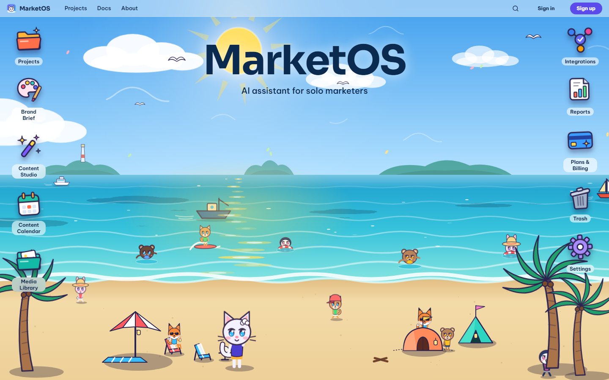
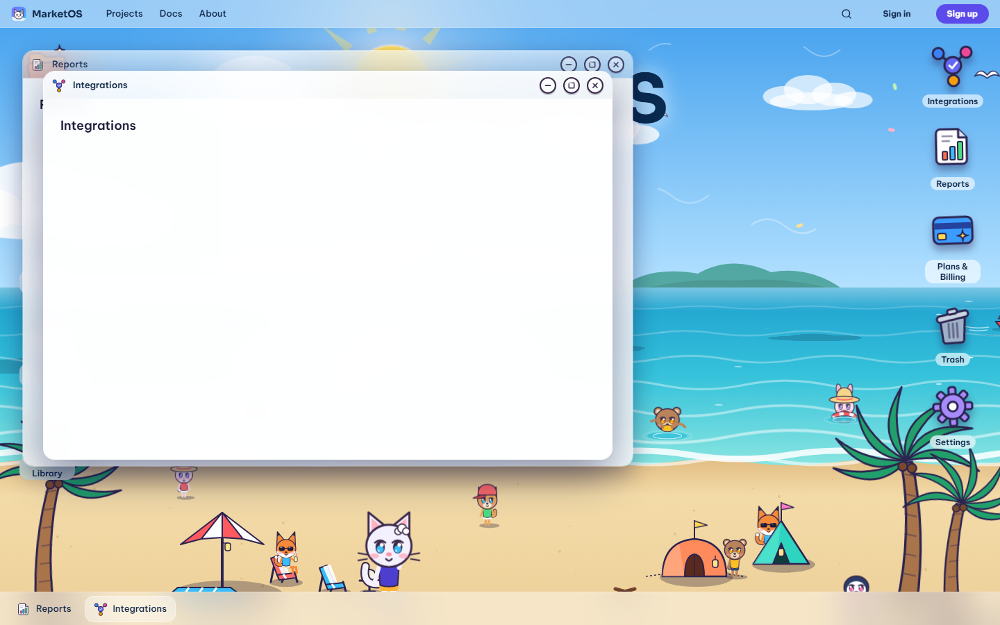
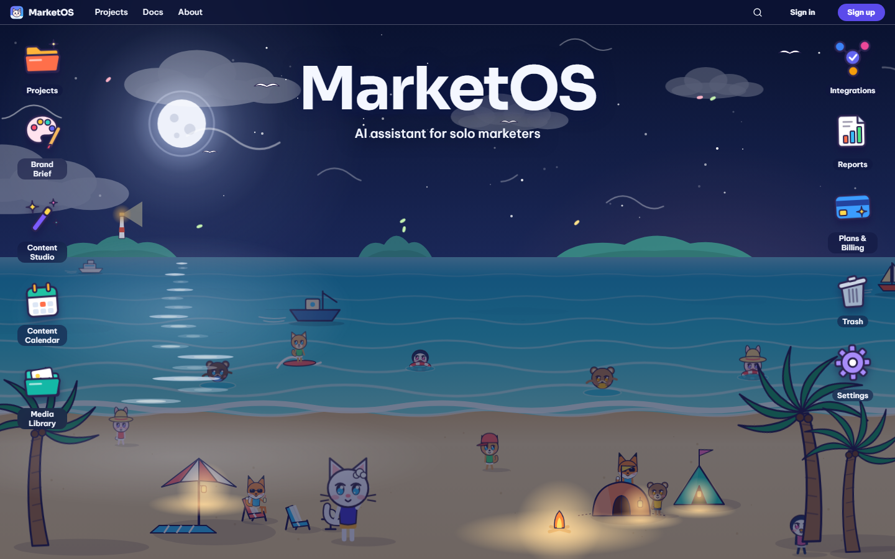
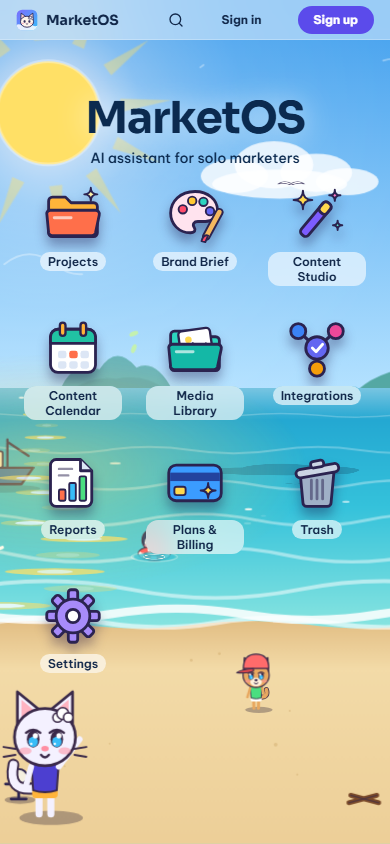
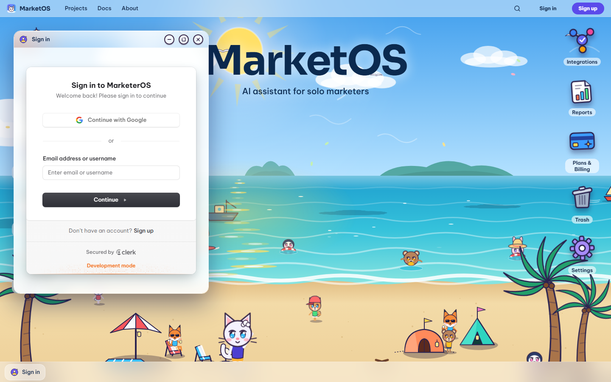
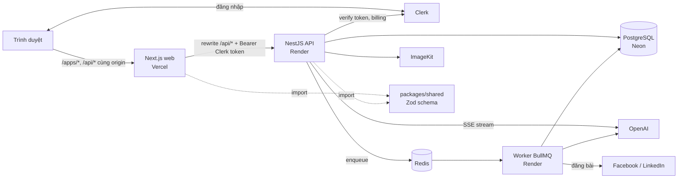

# MarketOS

Không gian làm việc AI cho marketer làm một mình, trình bày như một desktop: mỗi công cụ là một
cửa sổ app, mỗi project là một thư mục, và AI luôn đọc Brand Brief trước khi viết.



<!-- TODO: thay bằng GIF demo luồng Project → Brand Brief → Content Studio → Calendar -->

| | |
|---|---|
|  |  |
|  |  |

**Tính năng:** Projects + Trash, Brand Brief, Content Studio (3 biến thể stream qua SSE), duyệt và
lên lịch trên Content Calendar, Media Library (upload hoặc tạo ảnh AI), AI Assistant với action
áp dụng một chạm (Pro), Integrations Facebook/LinkedIn tự đăng bài (Pro), Automations chạy theo
lịch (Max), Reports + xuất CSV, gói Free/Pro/Max qua Clerk Billing.

## Kiến trúc



## Quyết định kiến trúc

- **Tách FE/BE (Next.js + NestJS):** web chỉ lo UI desktop và window manager; logic nghiệp vụ, quota,
  billing, AI và worker nằm ở API. Worker BullMQ dùng chung code với API nhưng chạy tiến trình riêng.
  Web gọi API qua rewrite `/api/*` cùng origin nên không cần CORS và token Clerk đi theo mỗi request.
- **Chỉ dùng OpenAI, bọc trong `OpenAiService` qua DI:** một provider giữ cấu hình đơn giản
  (`OPENAI_API_KEY`, `AI_MODEL` chỉ ở backend). Vì inject qua Nest DI, test unit/e2e thay bằng
  bản giả, không gọi mạng và không tốn quota.
- **Zod schema dùng chung (`packages/shared`):** request/response, mã lỗi, event SSE và giới hạn gói
  định nghĩa một lần; web validate form và parse response bằng cùng schema mà API dùng, nên lệch
  contract lộ ra lúc typecheck thay vì lúc chạy.
- **Clerk cho auth và billing:** không tự lưu mật khẩu hay xử lý thanh toán; API chỉ verify token và
  đọc plan/feature từ Clerk.

## Cài đặt và chạy

Chạy từ root project, dùng Node 24.15 trở lên trong nhánh 24 LTS và npm 12.
`.node-version` ghi phiên bản 24.21.0; dev dependency `node` cung cấp Node 24.21.0
cho các npm script. Dùng npm 12.1.0 để cài dependencies. npm 12 nhận đúng override trong workspace;
các bản npm cũ có thể báo dependency đã override là invalid.

```powershell
npm ci
docker compose up -d postgres
# Cấu hình .env theo apps/api/README.md và apps/web/.env.example trước khi chạy.
npm run build --workspace @marketos/shared
npm run db:deploy --workspace api
npm run dev
```

Web: `http://localhost:3000`; API: `http://localhost:3001`.
`npm run dev` chạy NestJS trước, chờ `/api/health` trả `status: ok`, `db: up`,
rồi mới khởi động Next.js. Gate chờ tối đa 300 giây; nếu API/DB chưa sẵn sàng,
Turbo báo lỗi và không khởi động web. Chạy qua Turbo với `--filter=web` cũng giữ gate này.
Chạy trực tiếp `npm run dev --workspace=web` bỏ qua gate.
Gate đọc `API_URL` từ env tiến trình hoặc `apps/web/.env.local`; nếu chưa đặt thì dùng
`http://localhost:3001`, cùng mặc định của Next rewrite. Nếu đổi cổng API, đặt `API_URL` tương ứng.
API đã có Clerk auth, Projects/Trash, Brand Brief, AI Content Studio qua SSE,
quota TEXT và API duyệt/lên lịch nội dung. Health public ở `/api/health`, Swagger ở `/docs`.
Xem [hướng dẫn API](./apps/api/README.md) để cấu hình env, migration và database test riêng.
Worker (automations, tự đăng bài) chạy riêng: `npm run worker --workspace api`.

Nếu Node của máy thấp hơn 24.15, có thể cài lần đầu bằng Node tạm từ npm:

```powershell
npx --yes --package=node@24.21.0 --package=npm@12.1.0 npm ci
```

## Kiểm tra

```powershell
npm run build
npm run typecheck
npm run lint
npm test
npm run test:e2e --workspace=api -- --runInBand
```

Chạy một app: `npm run dev --workspace=api` hoặc `npm run dev --workspace=web`.
Build `packages/shared` trước khi chạy riêng app: `npm run build --workspace=@marketos/shared`.

## Dependency và TypeScript

- Các dependency trực tiếp được đối chiếu npm registry ngày 30/09/2026 và pin phiên bản cụ thể;
  dùng một `package-lock.json` ở root để cài lặp lại bằng `npm ci`.
- NestJS 12, Next.js 16, React 19; OpenAI qua Vercel AI SDK; Clerk; Prisma với PostgreSQL adapter.
- TypeScript 6.0.3 là bản mới nhất tương thích với typescript-eslint và ts-jest hiện tại.
  TypeScript 7 chưa phù hợp với toolchain backend này; không dùng cờ bỏ qua peer dependency.
- Prisma CLI/client/adapter cùng 7.10.0 stable; dist-tag latest của CLI hiện trỏ vào 8.0.0 RC.
- Dùng class-validator/class-transformer vì nestjs-zod chưa công bố hỗ trợ NestJS 12.
- `@types/node` dùng bản mới nhất nhánh 24 để khớp runtime Node 24 LTS.
- Toàn repo dùng ESLint 9.39.5 vì các plugin của Next.js chưa hỗ trợ ESLint 10.
- Các optional peer Ajv của react-hook-form resolver được cài đúng range: Ajv 8 và ajv-formats 2.
  Giữ cùng phiên bản ESLint cho frontend/backend để tránh xung đột peer khi npm hoist package.
- Override deepmerge-ts và mysql2 trong dependency của Prisma bằng bản đã vá;
  giữ CLI/client/adapter Prisma cùng phiên bản stable.
- `allowScripts` cho phép các script cài binary của Node, Prisma và native build tools theo phiên bản
  đã kiểm tra, để npm 12 cài đủ chúng. Không thêm npm CLI vào dependency của ứng dụng.
- `tsconfig.base.json` bật strict. API/shared dùng NodeNext; web dùng bundler theo Next.js.
  Backend build chỉ nhận `src`, không đưa test vào output; shared xuất JS và declaration cho cả hai app.
- UI dùng shadcn/ui; worker dùng BullMQ với Redis.

Docker theo tài liệu: `pgvector/pgvector:pg16` và `redis:8.6`.
`docker-compose.yml` có PostgreSQL local trên cổng 5433; Redis thuộc profile `jobs`,
chỉ cần khi chạy worker (`docker compose --profile jobs up -d`).

## Deploy

- **Web → Vercel:** Root Directory `apps/web`, cấu hình và biến môi trường ở [apps/web/README.md](./apps/web/README.md#deploy-lên-vercel).
- **API + worker → Render, database → Neon, Redis trên Render:** xem [apps/api/README.md](./apps/api/README.md).
- Clerk dùng production instance và thêm domain của web vào Clerk.
